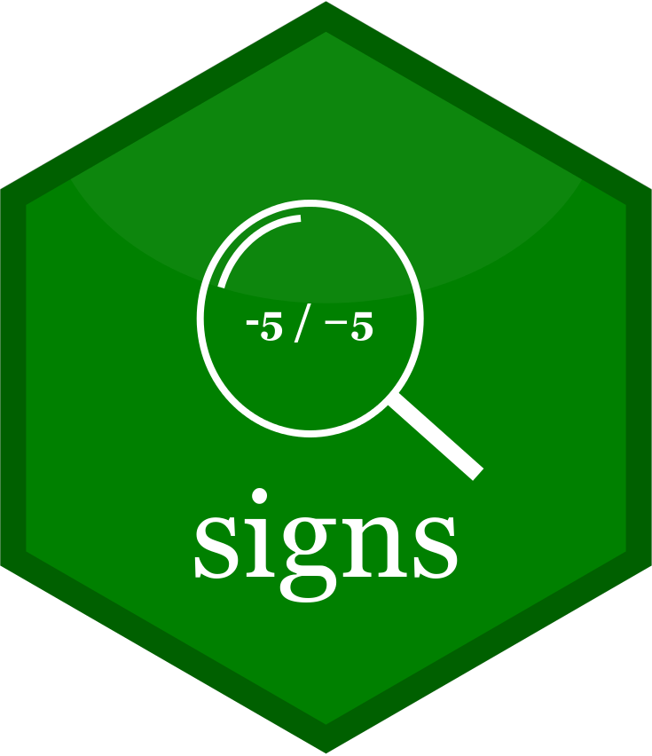
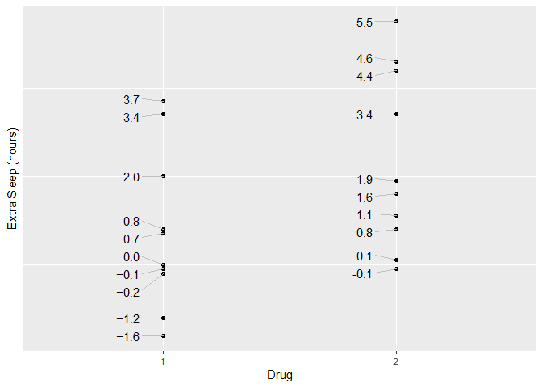

<!-- README.md is generated from README.Rmd. Please edit that file -->
signs <a href='https://benjaminwolfe.github.io/signs/'></a>
========================================================================================================================

<!-- badges: start -->
[](https://travis-ci.org/BenjaminWolfe/signs) [](https://codecov.io/gh/BenjaminWolfe/signs?branch=master) <!-- badges: end -->

`signs` makes it easy to use typographically accurate minus signs in plots, markdown, dashboards, or other displays.

Ask any typography nut, and they can walk you through the differences among 4 glyphs that look almost alike:

-   the hyphen-minus (-, ASCII 45)
-   the en-dash (–, Unicode 2013)
-   the em-dash (—, Unicode 2014)
-   the true minus (−, Unicode 2212)

In most fixed-width coding fonts, these are nearly (if not totally) indistinguishable. But a good font for plotting or reports will usually have a different glyph for each. The true minus takes up more space than the hyphen-minus (generally the width of a digit), and it often sits a little higher.

For me, using a Unicode minus is like brewing high-end tea or wearing my favorite socks. Maybe nobody else notices, but it still looks good to me. If you, similarly, enjoy the little things, this package may grow on you!

Installation
------------

`signs` is not yet available on [CRAN](https://CRAN.R-project.org). You can install it from [GitHub](https://github.com/BenjaminWolfe/signs) with:

``` r
# install.packages("devtools")
devtools::install_github("BenjaminWolfe/signs")
```

Example
-------

Using `signs` is simple, especially if you're familiar with functions like `scales::number()`, `scales::number_format()`, `scales::comma()`, `scales::comma_format()`, `scales::percent()`, and `scales::percent_format()`.

See `vignette("signs")` for a full tour of the package.

### Fixed-Width Fonts (indistinguishable)

As mentioned above, the difference is hard to see with a fixed-width typeface. That's not a problem with the package; it's just how these fonts work.

``` r
library(scales)
library(signs)

x <- seq(-4, 4)
number(x)
#> [1] "-4" "-3" "-2" "-1" "0"  "1"  "2"  "3"  "4"

signs(x)
#> [1] "-4" "-3" "-2" "-1" "0"  "1"  "2"  "3"  "4"
```

### Plots (distinguishable)

We can see the difference in a plot.

-   Points in group 1 are labeled with a true Unicode minus glyph: `signs()`. So is the y-axis: `signs_format()`.
-   Points in group 2 are labeled with the traditional ASCII hyphen-minus: `scales::number()`.
-   Usage is identical.

``` r
library(dplyr)
library(ggplot2)
library(ggrepel)

theme_set(theme_gray())
theme_update(panel.grid.minor = element_blank())

p <- 
  ggplot(sleep) +
  aes(group, extra) +
  geom_point() +
  xlab("Drug") +
  ylab("Extra Sleep (hours)")

label_hours <- function(mapping) {
  geom_text_repel(
    mapping,
    nudge_x = -.1,
    direction = "y",
    segment.size = .4,
    segment.color = "grey75",
    hjust = "right"
  )
}

p +
  label_hours(
    mapping = aes(
      label = case_when(
        group == 1 ~ signs(extra, accuracy = .1), # Unicode minuses
        group == 2 ~ number(extra, accuracy = .1) # ASCII minuses
      )
    )
  ) +
  scale_y_continuous(
    limits = c(-4, 6),
    breaks = seq(-4, 6),
    labels = signs_format(accuracy = .1) # Unicode, analogous to number_format() 
  )
```


