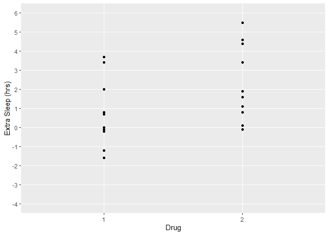
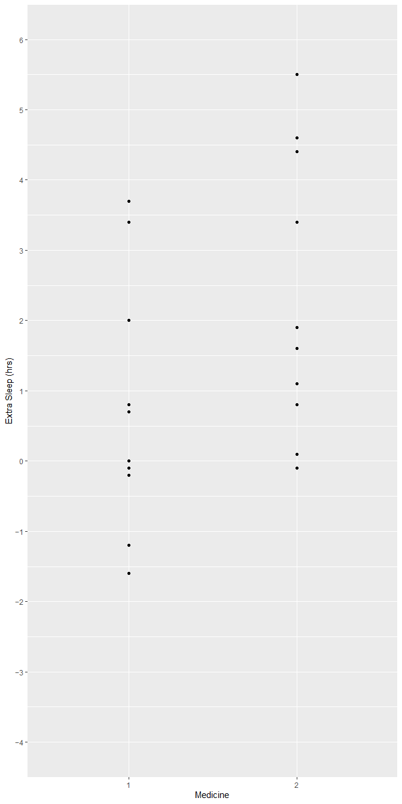
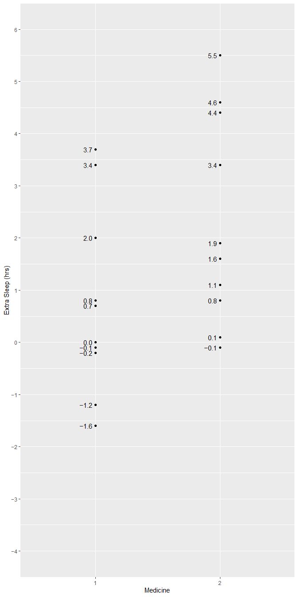
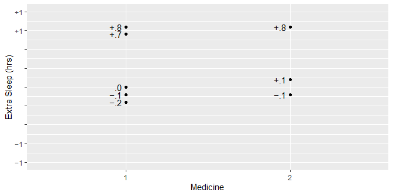
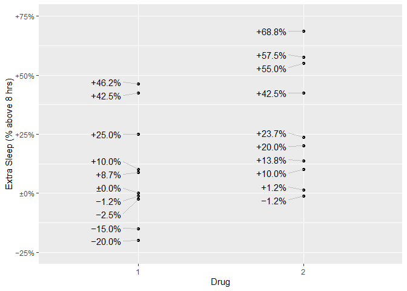

<!-- README.md is generated from README.Rmd. Please edit that file -->
signs <a href='https://benjaminwolfe.github.io/signs/'></a>
========================================================================================================================

<!-- badges: start -->
[](https://travis-ci.org/BenjaminWolfe/signs) <!-- badges: end -->

`signs` makes it easy to use typographically accurate minus signs in plots, markdown, dashboards, or other displays.

Ask any typography nut, and they can walk you through the differences among 4 glyphs that look almost alike:

-   the hyphen-minus (-, ASCII 45)
-   the en-dash (–, Unicode 2013)
-   the em-dash (—, Unicode 2014)
-   the true minus (−, Unicode 2212)

The en-dash and em-dash are named after their widths (the width of an `n` and `m`, respectively). The true minus is the width of a digit and sits a bit higher than the others. The hyphen-minus, an ASCII convention, is the only one we get on our keyboards.

These may be easier to distinguish in some fonts than others. In most fixed-width coding fonts, for example, they're nearly (if not totally) indistinguishable. But a good font for plotting will usually have a different glyph for each.

For me, using a true minus is like brewing high-end tea or wearing my favorite socks. Maybe nobody else notices, but it still feels good to me. If you feel the same way, this package may grow on you!

Installation
------------

`signs` is not yet available on [CRAN](https://CRAN.R-project.org). You can install it from [GitHub](https://github.com/BenjaminWolfe/signs) with:

``` r
# install.packages("devtools")
devtools::install_github("BenjaminWolfe/signs")
```

Examples
--------

Using `signs` is simple, especially if you're familiar with functions like `number()`, `number_format()`, `comma()`, `comma_format()`, `percent()`, and `percent_format()` from the [`scales`](https://scales.r-lib.org/reference/number_format.html) package. The package adds 2 functions analogous to these: `signs()` and `signs_format()`.

### Fixed-Width Fonts (indistinguishable)

As mentioned above, the difference is hard to see with a fixed-width typeface. That's not a problem with the package; it's just how these fonts work.

``` r
library(scales)
library(signs)

x <- seq(-5, 5)
number(x)
#>  [1] "-5" "-4" "-3" "-2" "-1" "0"  "1"  "2"  "3"  "4"  "5"
signs(x)
#>  [1] "-5" "-4" "-3" "-2" "-1" "0"  "1"  "2"  "3"  "4"  "5"
```

### Plots

We can see the difference in a plot. First, with `scales::number()`:

``` r
library(ggplot2)

p <- 
  ggplot(sleep) +
  aes(group, extra) +
  geom_point() +
  xlab("Drug") +
  ylab("Extra Sleep (hrs)") +
  theme(panel.grid.minor = element_blank())

p +
  scale_y_continuous(
    limits = c(-4, 6),
    breaks = seq(-4, 6),
    labels = number
  )
```



Now with `signs::signs()`:

``` r
p +
  scale_y_continuous(
    limits = c(-4, 6),
    breaks = seq(-4, 6),
    labels = signs
  )
```



We can use `signs()` in `geom_text()` as well. And we can pass it any of the arguments we would use with `scales::number()`, such as `accuracy` or `scale`.

``` r
library(ggrepel)

label_hours <- function(mapping) {
  geom_text_repel(
    mapping,
    nudge_x = -.1,
    direction = "y",
    segment.size = .2,
    segment.color = "grey75",
    hjust = "right"
  )
}

p +
  scale_y_continuous(
    limits = c(-4, 6),
    breaks = seq(-4, 6),
    labels = signs
  ) +
  label_hours(
    aes(label = signs(extra, accuracy = .1))
  )
```



In datasets where the point is to show change from zero, we can also add plus signs for positive numbers. Notice here we use `signs_format()` as well, analogous to `number_format()` and the other function factories in the `scales` package. `signs_format()` returns a function that will format a numeric vector with minus signs.

``` r
p +
  scale_y_continuous(
    limits = c(-4, 6),
    breaks = seq(-4, 6),
    labels = signs_format(add_plusses = TRUE)
  ) +
  label_hours(
    aes(label = signs(extra, add_plusses = TRUE, accuracy = .1))
  )
```


Sometimes we want a more minimal look. For plots on the interval `(-1, 1)`, we can trim leading zeros. And if we want we can leave zero itself blank:

``` r
p +
  scale_y_continuous(
    limits = c(-.8, .8),
    breaks = seq(-.8, .8, by = .2),
    labels = signs_format(
      add_plusses = TRUE,
      trim_leading_zeros = TRUE,
      treatment_at_zero = "blank",
      accuracy = .01
    )
  ) +
  label_hours(
    aes(
      label = signs(
        extra,
        add_plusses = TRUE,
        trim_leading_zeros = TRUE,
        accuracy = .1
        )
      )
    )
#> Warning: Removed 12 rows containing missing values (geom_point).
#> Warning: Removed 12 rows containing missing values (geom_text_repel).
```



You can use any arbitrary function to format your number, rather than `scales::number()`. Here we make the ridiculous assumption that everybody gets 8 hours of sleep, just so we can use `scales::percent()`.

``` r
library(dplyr)

q <- 
  sleep %>% 
  mutate(percent_change = extra / 8) %>% 
  ggplot() +
  aes(group, percent_change) +
  geom_point() +
  xlab("Drug") +
  ylab("Extra Sleep (% above 8 hrs)")

q +
  scale_y_continuous(
    limits = c(-.25, .75),
    breaks = seq(-.25, .75, by = .25),
    labels = signs_format(format = percent, add_plusses = TRUE, accuracy = 1)
  ) +
  label_hours(
    aes(
      label = signs(
        percent_change,
        format = percent,
        add_plusses = TRUE,
        accuracy = .1
      )
    )
  )
```


You can also use a plus-or-minus symbol in front of the zero.

``` r
q +
  scale_y_continuous(
    limits = c(-.25, .75),
    breaks = seq(-.25, .75, by = .25),
    labels = signs_format(
      format = percent,
      add_plusses = TRUE,
      treatment_at_zero = "symbol",
      accuracy = 1
    )
  ) +
  label_hours(
    aes(
      label = signs(
        percent_change,
        format = percent,
        add_plusses = TRUE,
        treatment_at_zero = "symbol",
        accuracy = .1
      )
    )
  )
```


