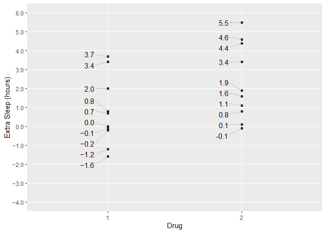

<!-- README.md is generated from README.Rmd. Please edit that file -->

# signs <a href='https://benjaminwolfe.github.io/signs/'></a>

<!-- badges: start -->

[](https://travis-ci.org/BenjaminWolfe/signs)
[](https://ci.appveyor.com/project/BenjaminWolfe/signs)
[](https://codecov.io/gh/BenjaminWolfe/signs?branch=master)
[](https://CRAN.R-project.org/package=signs)
[](https://www.tidyverse.org/lifecycle/#maturing)
<!-- badges: end -->

`signs` makes it easy to use typographically accurate minus signs in
plots, markdown, dashboards, or other presentations.

Ask any typography nut, and they can walk you through the differences
among 4 symbols that look nearly identical:

  - the hyphen-minus (-, ASCII 45, next to the zero key)
  - the en-dash (–, Unicode 2013, Alt+0151 on Windows)
  - the em-dash (—, Unicode 2014, Alt+0150 on Windows)
  - the true minus (−, Unicode 2212)

The true minus, when a typeface has one, is *designed for mathematics*.
It has the same length and line thickness as the crossbar of the plus
sign, and it sits at the same height above the baseline. By comparison,
the hyphen-minus is quite a bit shorter and sits lower. Hyphens were
designed, not for mathematics, but primarily for joining words.

Oddly there is no shortcut for true minuses on Windows. There are a [few
options on Mac](https://apple.stackexchange.com/q/39448/359228), and of
course [major Linux distros like Ubuntu support entering
Unicode](https://askubuntu.com/a/31283). Fixed-width coding fonts that
are intended for coding, such as
[FiraCode](https://github.com/tonsky/FiraCode), use ligatures to mimic
the minus glyph. But the Unicode minus will work with whatever
presentation font you prefer, and it has the advantage of being
understood properly by most screen readers.

For me, using a Unicode minus is like brewing high-end tea or wearing my
favorite socks. Maybe nobody else notices, but it still looks good to
me. If you like me enjoy the little things, this package may grow on
you\!

## Installation

You can install `signs` from
[CRAN](https://cran.r-project.org/package=signs),

``` r
install.packages("signs")
```

or grab the dev version from
[GitHub](https://github.com/BenjaminWolfe/signs):

``` r
# install.packages("devtools")
devtools::install_github("BenjaminWolfe/signs")
```

## Example

Using `signs` is simple, especially if you’re familiar with functions
like `scales::number()`, `scales::number_format()`, `scales::comma()`,
`scales::comma_format()`, `scales::percent()`, and
`scales::percent_format()`. It simply provides two new functions to
complement these: `signs::signs()` and `signs::signs_format()`.

See `vignette("signs")` for a full tour of the package.

### Fixed-Width Fonts (indistinguishable)

The difference between minuses is impossible to see with most coding
typefaces. That’s not a problem with the package; it’s just how
fixed-width fonts work. (How ugly would your code look if characters had
different widths?)

``` r
library(scales)
library(signs)

x <- seq(-4, 4)

# hyphen-minuses
number(x, accuracy = 1)
#> [1] "-4" "-3" "-2" "-1" "0"  "1"  "2"  "3"  "4"

# true minuses
signs(x, accuracy = 1)
#> [1] "−4" "−3" "−2" "−1" "0"  "1"  "2"  "3"  "4"
```

### Plots (distinguishable)

We can see the difference in a plot.

  - Points in group 1 are labeled with a true Unicode minus glyph:
    `signs()`. So is the y-axis: `signs_format()`.
  - Points in group 2 are labeled with the traditional ASCII
    hyphen-minus: `scales::number()`.
  - Basic usage is identical.

<!-- end list -->

``` r
library(dplyr)
library(ggplot2)
library(ggrepel)

theme_set(theme_gray())
theme_update(panel.grid.minor = element_blank())

p <- 
  ggplot(sleep) +
  aes(group, extra) +
  geom_point() +
  xlab("Drug") +
  ylab("Extra Sleep (hours)")

label_hours <- function(mapping) {
  geom_text_repel(
    mapping,
    nudge_x       = -.1,
    direction     = "y",
    segment.size  = .4,
    segment.color = "grey75",
    hjust         = "right"
  )
}

p +
  label_hours(
    mapping = aes(
      label = case_when(
        group == 1 ~ signs(extra, accuracy = .1), # Unicode minuses
        group == 2 ~ number(extra, accuracy = .1) # ASCII minuses
      )
    )
  ) +
  scale_y_continuous(
    limits = c(-4, 6),
    breaks = seq(-4, 6),
    labels = signs_format(accuracy = .1) # Unicode, analogous to number_format() 
  )
```



### Credits

  - Thanks to Jon Harmon (@JonTheGeek on
    [Twitter](https://twitter.com/JonTheGeek) and
    [GitHub](https://github.com/jonthegeek)) for the insight on screen
    readers\!
  - Thanks to my dad Matthew E. Wolfe for the crisp summary of Unicode
    2212’s design advantages vis-a-vis the plus sign.
